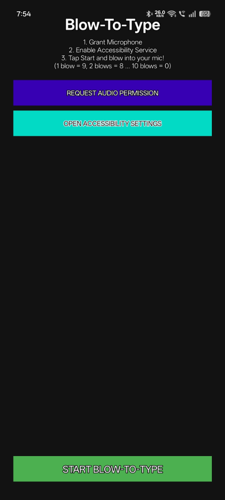

# AeroPass 🎯

## Basic Details
### Team Name: Useless Projects 3.0

### Team Members
- Team Lead: Akhinesh Kumar - Saingits collage of engineering (Autonomous)
- Member 2: Peter Alex - Saingits collage of engineering (Autonomous)

### Project Description
Security meets respiratory endurance! This Android Accessibility app replaces your boring lock screen with a breath-activated Morse code system. By blowing into the microphone, the app simulates physical ghost taps to type your PIN. It is wildly inefficient, totally exhausting, and beautifully useless.

### The Problem (that doesn't exist)
Tapping your PIN with your fingers is too fast, too convenient, and entirely too easy. Your lungs are getting no exercise, and unlocking your phone doesn't feel like enough of an achievement.

### The Solution (that nobody asked for)
AeroPass! We built a background Android Accessibility Service that listens to your microphone. Need to type a 9? Just blow into the mic 1 time! Need to type an 8? That's 2 blows. If you want to type a 0, you have to blow 10 times in a row. Our app maps your blows and dispatches physical ghost-taps on the exact X/Y coordinates of your screen's number pad. 

## Technical Details
### Technologies/Components Used
For Software:
- Kotlin
- Android AccessibilityService API (for ghost taps)
- Android AudioRecord API (for blow detection)
- Gradle

### Implementation
For Software:
# Installation
1. Clone the repository.
2. Open the project in Android Studio.
3. Build the APK using Gradle (`./gradlew assembleDebug`).
4. Install the APK on your Android device via `adb install` or directly.

# Run
1. Open the AeroPass app and grant Microphone permissions.
2. Go to your device's Accessibility Settings and enable the AeroPass service.
3. Tap "START BLOW-TO-TYPE" in the app.
4. Lock your phone, wake the screen, and start blowing! (1 blow = 9, 10 blows = 0).

### Project Documentation
For Software:

# Screenshots

*AeroPass Cover Image*

 

*AeroPass Main Screen - Where the magic begins*
